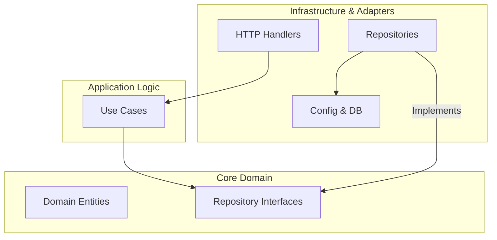
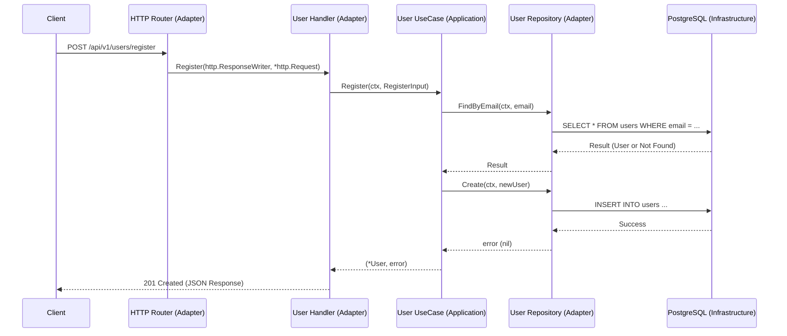
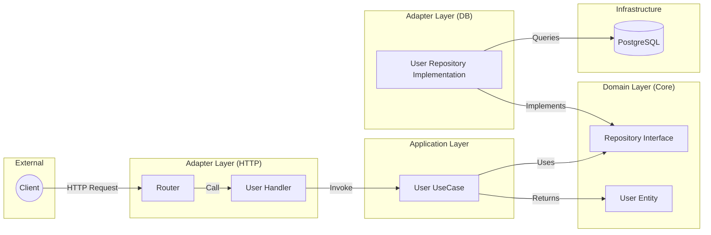

# Go Clean Architecture Template

A robust and scalable Go project template following the principles of **Clean Architecture**. This template is designed to provide a solid foundation for building maintainable and testable web applications.

## 🏗️ Architecture Overview

The project is structured into layers to ensure a separation of concerns and maintain a one-way dependency flow towards the core business logic.



### 📁 Project Structure

```text
.
├── cmd/api/main.go          # Application entry point & dependency injection
├── internal/
│   ├── adapter/             # Interface Adapters
│   │   ├── http/            # REST API Handlers & Routers
│   │   └── repository/      # Database implementations (GORM)
│   ├── core/                # Infrastructure & Cross-cutting concerns
│   │   ├── config/          # Configuration loading
│   │   └── database/        # Database connection setup
│   ├── domain/              # Core Business Logic (Entities & Interfaces)
│   │   └── user/            
│   └── usecase/             # Application Business Logic (Orchestrators)
│       └── user/
├── pkg/                     # Shared utilities (Logger, Errors, Responses)
└── .env.example             # Environment variables template
```

---

## 🔄 Communication Flow

This template follows a strict communication flow. Below are diagrams illustrating how a typical request (e.g., "Register User") moves through the system.

### 1. Sequence of Interaction
This diagram shows the execution flow from the moment a client sends a request.



### 2. Dependency & Connection Flow
This diagram shows how the components are physically connected via interfaces.



### Layer Responsibilities:

1.  **Request Layer (Router)**: Handles routing and middleware (Auth, Logging).
2.  **Adapter Layer (Handler)**: Unmarshals JSON request body, validates input, calls the UseCase, and marshals the JSON response.
3.  **UseCase Layer**: Contains the "What" of the application. It orchestrates domain entities and repository interfaces to fulfill a business requirement.
4.  **Domain Layer**: The heart of the app. It defines the business rules (Entities) and the contracts (Interfaces) that other layers must follow.
5.  **Adapter Layer (Repository)**: Handles the "How" of data persistence. It translates domain-agnostic calls into GORM/SQL queries.

---

## 🚀 Getting Started

### Prerequisites
- Go 1.21+
- PostgreSQL (or your preferred database supported by GORM)

### Setup
1. Clone the repository.
2. Copy `.env.example` to `.env` and fill in your database credentials.
3. Install dependencies:
   ```bash
   go mod download
   ```
4. Run the application:
   ```bash
   go run cmd/api/main.go
   ```

## 🛠️ Features Included
- **Clean Architecture** structure.
- **Dependency Injection** in `main.go`.
- **GORM** for database operations.
- **Graceful Shutdown** of the HTTP server.
- **Custom Error Handling** and standardized JSON responses.
- **Structured Logging** using `slog`.
- **JWT** authentication support.
